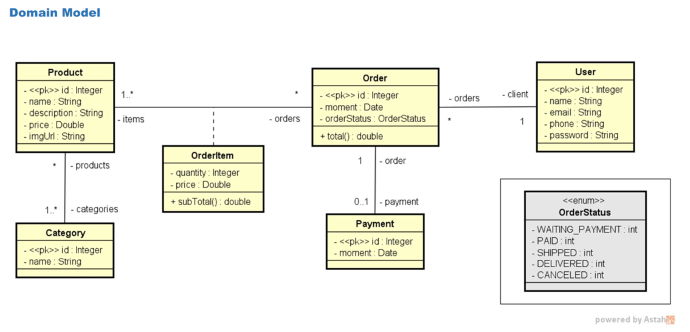

# 🛒 Springboot JPA

Projeto de estudo de uma **API REST** construída com **Spring Boot**, **Spring Data JPA** e **Hibernate**, simulando o backend de um pequeno sistema de e-commerce (usuários, produtos, categorias, pedidos, itens de pedido e pagamento).

<p align="center">
  
  
  
  
  
</p>

<p align="center">
  
  
</p>

---

## 📑 Sumário

- [Sobre o projeto](#-sobre-o-projeto)
- [Modelo de domínio](#-modelo-de-domínio)
- [Tecnologias](#-tecnologias)
- [Endpoints da API](#-endpoints-da-api)
- [Tratamento de erros](#-tratamento-de-erros)
- [Como executar](#-como-executar)
- [Estrutura do projeto](#-estrutura-do-projeto)
- [Dados de teste (seed)](#-dados-de-teste-seed)
- [Autor](#-autor)

---

## 📖 Sobre o projeto

Este repositório é um projeto pessoal de aprendizado de **Java** e **Spring Boot**, desenvolvido durante meus estudos de backend. O objetivo é praticar, na prática, os principais conceitos de uma API REST profissional:

- Modelagem de domínio com **JPA/Hibernate** (relacionamentos `@OneToMany`, `@ManyToOne`, `@ManyToMany` e chave composta com `@Embeddable`);
- Arquitetura em camadas: **Controller → Service → Repository**;
- Tratamento centralizado de exceções (`@ControllerAdvice`);
- Testes com banco de dados em memória (**H2**) e suporte a **PostgreSQL** em produção.

> 💡 Projeto construído com apoio de cursos de Java/Spring Boot, como forma de fixar conceitos de POO, camadas de aplicação e persistência de dados.

## 🧩 Modelo de domínio

O diagrama abaixo representa as entidades da aplicação e como elas se relacionam:



Resumo das entidades:

| Entidade | Descrição | Principais atributos |
|---|---|---|
| `User` | Cliente da loja | `name`, `email`, `phone`, `password` |
| `Product` | Produto vendido | `name`, `description`, `price`, `imgUrl` |
| `Category` | Categoria de produto (N:N com `Product`) | `name` |
| `Order` | Pedido feito por um `User` | `moment`, `orderStatus`, `total()` |
| `OrderItem` | Item de um pedido (chave composta `Order` + `Product`) | `quantity`, `price`, `subTotal()` |
| `Payment` | Pagamento associado a um `Order` (1:1) | `moment` |
| `OrderStatus` | Enum com o status do pedido | `WAITING_PAYMENT`, `PAID`, `SHIPPED`, `DELIVERED`, `CANCELED` |

## 🚀 Tecnologias

- [Java 25](https://openjdk.org/)
- [Spring Boot 4.1.0](https://spring.io/projects/spring-boot)
- [Spring Web (MVC)](https://docs.spring.io/spring-framework/reference/web/webmvc.html)
- [Spring Data JPA](https://spring.io/projects/spring-data-jpa) + [Hibernate](https://hibernate.org/)
- [H2 Database](https://www.h2database.com/) — banco em memória para desenvolvimento/testes
- [PostgreSQL](https://www.postgresql.org/) — banco relacional pronto para produção
- [Maven](https://maven.apache.org/) — gerenciador de dependências e build

## 🔗 Endpoints da API

URL base local: `http://localhost:8080`

### 👤 Usuários — `/users`

| Método | Endpoint | Descrição |
|---|---|---|
| `GET` | `/users` | Lista todos os usuários |
| `GET` | `/users/{id}` | Busca um usuário pelo id |
| `POST` | `/users` | Cadastra um novo usuário |
| `PUT` | `/users/{id}` | Atualiza um usuário existente |
| `DELETE` | `/users/{id}` | Remove um usuário |

### 📦 Produtos — `/products`

| Método | Endpoint | Descrição |
|---|---|---|
| `GET` | `/products` | Lista todos os produtos |
| `GET` | `/products/{id}` | Busca um produto pelo id |

### 🏷️ Categorias — `/categories`

| Método | Endpoint | Descrição |
|---|---|---|
| `GET` | `/categories` | Lista todas as categorias |
| `GET` | `/categories/{id}` | Busca uma categoria pelo id |

### 🧾 Pedidos — `/orders`

| Método | Endpoint | Descrição |
|---|---|---|
| `GET` | `/orders` | Lista todos os pedidos |
| `GET` | `/orders/{id}` | Busca um pedido pelo id |

## ⚠️ Tratamento de erros

A API possui um manipulador global de exceções (`@ControllerAdvice`) que padroniza as respostas de erro:

| Situação | Status HTTP | Exceção |
|---|---|---|
| Recurso não encontrado (`findById`, `update`, `delete`) | `404 Not Found` | `ResourceNotFoundException` |
| Violação de integridade no banco (ex: excluir usuário com pedidos vinculados) | `400 Bad Request` | `DatabaseException` |

Exemplo de resposta de erro:

```json
{
  "timestamp": "2026-09-03T12:00:00Z",
  "status": 404,
  "error": "Resource not found",
  "message": "Entity not found",
  "path": "/users/99"
}
```

## ▶️ Como executar

### Pré-requisitos

- [JDK 25](https://adoptium.net/) instalado
- Maven (o projeto já inclui o wrapper `mvnw` / `mvnw.cmd`, não é obrigatório ter o Maven instalado)

### Passo a passo

```bash
# 1. Clone o repositório
git clone https://github.com/PedroSgorla/springboot-jpa.git

# 2. Acesse a pasta do projeto
cd springboot-jpa

# 3. Execute a aplicação (Windows)
mvnw.cmd spring-boot:run

# 3. Execute a aplicação (Linux/macOS)
./mvnw spring-boot:run
```

A aplicação sobe por padrão com o profile **`test`**, que utiliza o banco **H2 em memória** já populado com dados de exemplo (veja [Dados de teste](#-dados-de-teste-seed)).

- API disponível em: `http://localhost:8080`
- Console do H2 disponível em: `http://localhost:8080/h2-console`
  - JDBC URL: `jdbc:h2:mem:testdb`
  - Usuário: `sa` — Senha: *(em branco)*

## 🗂️ Estrutura do projeto

```
src/main/java/com/personal/learning
├── config           # Configurações da aplicação (ex: carga de dados de teste)
├── entities         # Entidades JPA (User, Product, Category, Order, OrderItem, Payment)
│   ├── enums        # Enum OrderStatus
│   └── pk           # Chaves compostas (OrderItemPK)
├── repositories     # Interfaces Spring Data JPA
├── services         # Regras de negócio
│   └── exceptions   # Exceções customizadas de serviço
└── resources        # Controllers REST
    └── exceptions   # Tratamento global de exceções
```

## 🌱 Dados de teste (seed)

Ao rodar com o profile `test`, a classe `TestConfig` popula automaticamente o banco H2 com:

- 3 categorias (Electronics, Books, Computers)
- 5 produtos vinculados às categorias
- 2 usuários
- 3 pedidos, com itens de pedido e 1 pagamento associado

Isso permite testar todos os endpoints imediatamente após iniciar a aplicação, sem precisar cadastrar dados manualmente.

## 👨‍💻 Autor

Desenvolvido por **Pedro** durante os estudos de Java e Spring Boot.

[](https://github.com/PedroSgorla)
